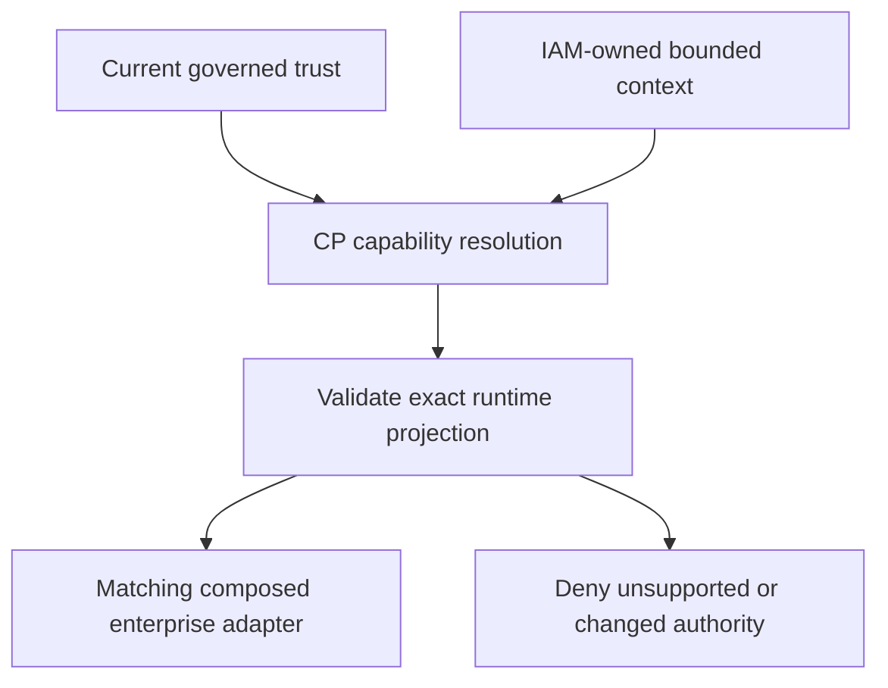

# Enterprise CP resolution and IAM dispatch (bounded MP3/MP4 convergence)

The enterprise composition root can now execute:



The canonical capability is `identity.authentication.perform` major 1. The
approved trust determines OIDC_FEDERATION or SAML_FEDERATION; those are runtime
facets, not new platform keys. `identity.federation.enterprise` stays a candidate.
CP remains provider/support/binding/grant/topology/health/residency authority.
IAM's executable adapter inventory is not a registry and conveys no authority.

## Protected service configuration

Add to the existing enterprise federation-authority configuration:

```json
{
  "CPResolutionContextFile": "/run/iam/cp-resolution-context.json",
  "CPResolutionTokenFile": "/run/iam/cp-resolution-token",
  "BrokerServiceReference": "service://baobab-iam/enterprise-federation"
}
```

The logical service reference must exactly match CP's registered invocation for
the selected provider. It is never a hostname used for networking. The existing
BrokerProviderID/BrokerEngineInstanceID configure the available Keycloak adapter
mechanics; they cannot override CP's result or select a fallback.

The context file contains only a handle and the original CP context's expiry:

```json
{
  "context_id": "REPLACE_WITH_CP_ISSUED_CONTEXT_ID",
  "expires_at": "2026-10-05T17:00:00Z"
}
```

The timestamp above is illustrative. Obtain a fresh context through CP's
existing governed context-resolution path, using the **same canonical IAM
workload principal** as CPResolutionTokenFile. CP requires ACTIVE registration,
`context:resolve`, the required governed grants and exact context ownership.
A context created by an estate BFF cannot be transferred to IAM. Keep
organisation/estate/environment/market/residency requirements in approved
context acquisition configuration; a login request cannot override them.

An independently supervised deployment process must obtain/renew the context
and credential before expiry and atomically publish private regular files
(0600, protected parent directory, no symlinks). Both files are reread for every
dispatch; token rotation must preserve canonical caller ownership. The context
file is not proof of ownership or entitlement: CP independently checks both.
This increment does not invent a context or automatically grant a scope,
activate a workload, publish provider support or onboard an estate.

Use a separately configured credential for resolution. CPTokenFile continues to
serve existing federation authority reads under `federation-authority:read`;
that scope does not imply `context:resolve`. Canonical registration/activation
must be completed independently before staging acceptance. No credential value
belongs in this JSON, a repository, logs or command arguments.

Production enterprise startup requires all three dispatch fields, as well as
the existing PostgreSQL shared-storage requirement. Partial configuration is
rejected in every environment. Staging/CI can retain the explicit pre-MP4 bound
mode by omitting all three fields. Once dispatch is configured, a resolution
failure never falls back to that bound mode. Non-enterprise direct OIDC mode
does not acquire new dispatch behavior in this bounded increment.

## Per-operation validation

Begin, callback and configured readiness independently obtain a new CP decision.
The response must match capability, contract major, context and generated
correlation; contain a real grant/binding/invocation; and have a bounded, current
lifetime no longer than the context. Only RESOLVED is executable. Unknown fields,
duplicate JSON, wrong media, redirects, malformed/oversized bodies and transport
outages are rejected by the authenticated fixed-origin transport. Optional
invocation extensions are unsupported in this bounded consumer and fail closed.

The chosen provider/instance must match the current FederationTrust, logical
service and a composed adapter. The current CP federation projection must match
scope and protocol, ACTIVE provider/instance/binding, VERIFIED facet, current
profile revision, approved configuration/security-domain references and the
exact observed deployment artifact. CP generic resolution separately checks grants, support, binding eligibility,
health and its existing context/policy constraints. This increment does not
strengthen or certify CP's underlying residency-policy implementation. IAM rechecks the
trust snapshot and evidence lifetimes before adapter invocation; callback
protocol verification still binds the persisted original event to that trust.

No enterprise-to-native fallback, provider retry list, issuer-selected discovery,
email linking, business authorization or credential downgrade is introduced.
If CP selects an adapter absent from the local deployment, execution is denied.
Suspension, revocation, expiry and changed evidence on callback deny completion.

Structured observations contain only resolution/correlation IDs, selected
provider/instance IDs and SELECTED/DENIED. They describe dispatch, not successful
authentication. No callback, subject, trust material or credential is logged.

## Evidence and remaining scope

The authority-service composition invokes EnterpriseDispatch rather than an
isolated helper. Tests cover CP TLS wire → current profile projection → adapter,
both protocol facets, substitutions, missing adapters, stale evidence, authority
outages and callback revalidation. Actual Keycloak OIDC/SAML CI broker tests now
use this dispatcher with explicitly synthetic CP authorities. The pinned Shared
validator checks JSON emitted by the real Go resolution request/response types.

This closes the bounded enterprise CP-resolution-to-adapter path and reuses the
existing CP profile projection. It does not close all MP3/MP4: production provider
support publication, broader native/workload capability dispatch/conformance,
provider-neutral login discovery, supervised live context acquisition and
staging consumer/operational acceptance remain separate work. CP/IAM fixture
evidence does not establish a production binding or certify a deployment.
