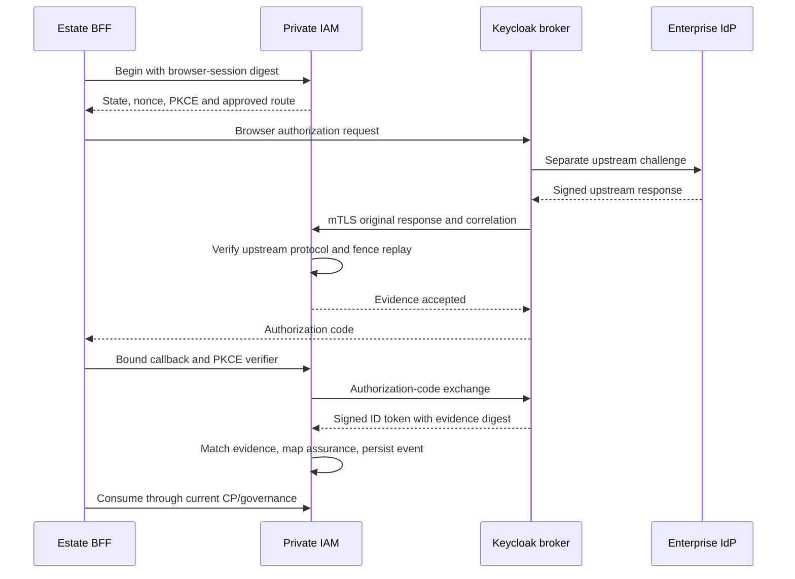

# Permanent Keycloak enterprise federation (MP8)

Keycloak remains the bounded enterprise federation provider. The permanent
`provider.EnterpriseFederationProvider` port and `keycloak.EnterpriseAdapter`
run an explicitly bound enterprise login, returning an opaque authentication
event. Native human identity stays with Kratos; OAuth/workload issuance stays
with Hydra. CP resolves the upstream issuer/subject and all business authority.
The legacy compatibility adapter's unsupported methods remain separate.

## Evidence handoff



The compiled `baobab-evidence-bridge` identity-provider mapper obtains the
ORIGINAL upstream OIDC ID token or SAML POST response and the broker's upstream
nonce/request ID. It submits them to private IAM under its independently
registered workload bearer and client certificate. Failure denies login. No
upstream token is placed in a user attribute or retained provider token store.
The mapper writes only `baobab_upstream_evidence_digest` to the user-session note.

The BFF client must have an `oidc-usersessionmodel-note-mapper` that emits that
note as `baobab_upstream_evidence_digest` in the ID token (String; ID token true,
access/userinfo token false). Completion verifies the Keycloak issuer, signature,
exact client audience, nonce, time and exact original-response digest. The
broker-local subject never supplies CP canonical identity or upstream assurance.
A signed downstream token with missing/mismatched upstream proof is rejected.

## Explicit service binding

Add these fields to the protected federation-authority configuration:

```json
{
  "EnterpriseBroker": true,
  "BrokerProviderID": "provider_REVIEWED_ID",
  "BrokerEngineInstanceID": "ei_REVIEWED_ID",
  "BrokerIssuer": "https://keycloak.private.example/realms/enterprise",
  "BrokerClientSecretFile": "/run/iam/enterprise-client-secret"
}
```

Replace the provider/instance placeholders with approved IDs. The issuer must
match the native approved broker configuration. The secret path is optional only
for an explicitly reviewed public PKCE client; confidential clients require it.
The deployment token source rereads protected credentials for each exchange.
The production composition permits HTTPS only, verifies configured CA roots and
rejects token-endpoint redirects. No token-derived discovery or route selection
occurs. For CP resolution before adapter dispatch, configure the
[bounded MP3/MP4 dispatch composition](enterprise-capability-dispatch.md);
production enterprise mode requires it. The concrete adapter remains bound to
its exact provider and instance and cannot override the CP decision.

Enterprise mode mounts only `/internal/enterprise-federation/v1/` event routes;
the direct OIDC completion path is not a fallback. With `Storage` configured,
PostgreSQL 17 holds shared broker state and coordinates replicas with transaction
locks and externally pinned recovery epochs. Production startup requires shared
storage. Without `Storage`, `broker.db` remains a protected single-writer bbolt
staging ledger; ephemeral ECS storage is unsuitable. Shutdown drains requests
before closing storage. Readiness checks the approved OIDC/SAML trust and CP
runtime facet. See [shared-state recovery](federation-shared-storage.md); actual
cloud failover/restore, throughput and approved RPO/RTO remain acceptance work.

## Approved non-secret native documents

The `federation_configuration` target supports:

```json
{
  "ClientID": "upstream-client-registered-for-keycloak",
  "SigningAlgorithm": "RS256",
  "Broker": {
    "Issuer": "https://keycloak.private.example/realms/enterprise",
    "ClientID": "enterprise-bff",
    "AuthorizationEndpoint": "https://keycloak.private.example/realms/enterprise/protocol/openid-connect/auth",
    "TokenEndpoint": "https://keycloak.private.example/realms/enterprise/protocol/openid-connect/token",
    "RedirectURI": "https://estate.example/auth/enterprise/callback",
    "ProviderRoute": "reviewed-enterprise-alias",
    "SigningAlgorithm": "RS256",
    "Confidential": true
  }
}
```

OIDC trust material has separate `JWKS` (original upstream signing keys) and
`BrokerJWKS` (Keycloak downstream keys), both public-only. Configuration is bound
to exact trust, snapshot, revision, provider, instance and scope with current
approval receipts. Key rotation requires reviewed immutable references/revisions;
unknown keys do not trigger network discovery or fallback.

For SAML, add `SAML` with `EntityID` (the Keycloak SP entity ID) and `ACSURL`
(the exact Keycloak broker POST endpoint). The trust-material document contains
`SigningCertificates`, an array of approved PEM public signing certificates,
and `BrokerJWKS`. OIDC-only upstream fields are unused for SAML. No private
signing/encryption key belongs in these targets. Rotation may overlap up to eight
approved public certificates; expired certificates are not accepted.

OIDC assurance rules use `ACR`, required `AMR` methods and `Level`. SAML rules use
`AuthnContextClassRef` and `Level`, with empty ACR and no AMR. Exactly one rule
must match. A separately CP-registered, IAM-approved event decision still binds
issuer, subject, event, level and normalized evidence digest. Policy matching
alone is not an approval receipt. Protected reviewed targets can be atomically
published and reloaded without restarting the service.

## Supported SAML profile and identity semantics

The bounded path supports SP-initiated SAML 2.0 HTTP POST, one unencrypted
assertion, approved RSA-SHA256 or ECDSA-SHA256 signatures and SHA-256 digests.
IAM independently verifies XML signatures using the maintained SAML/DSig
libraries, then exact recipient, SP audience, request correlation, issuer,
conditions, authentication time, explicit session expiry and AuthnContext.
Unsolicited/IdP-initiated, artifact, encrypted, multiple/wrapped assertion and
weak-signature profiles fail closed. No global verifier clock is changed.

NameID must use the persistent format. NameQualifier and SPNameQualifier must be
absent (their defined default) or match the approved issuer and SP entity ID.
SPProvidedID and email/transient NameID profiles are unsupported. The normalized
subject is `saml2:persistent:` plus the lower-case SHA-256 of compact UTF-8 JSON
`[persistent-format-URI, issuer, SP-entity-ID, NameID-value]`. This preserves the
qualified persistent identity across SPs without exposing a broker-local ID.
CP ExternalIdentity onboarding must register that exact issuer/subject pair.
Changing SP identity is a governed identity migration; never relink by email.

Raw XML/token/library errors are discarded because SAML verifier errors can
contain assertions. Only normalized evidence, exact configuration bindings and
hashes persist. Original upstream assertions, authorization codes, PKCE
verifiers, state, nonce and browser secrets remain outside the ledger.
Replay fences persist through restart and the maximum accepted token lifetime.
Pruning is bounded and shares the durable monotonic-clock fence. This path has
an explicit 4,096 unexpired-request staging ceiling; HA/shared storage remains
an operational acceptance requirement.

## Private operations and credentials

| POST suffix | Admitted action | Request fields besides TrustID |
| --- | --- | --- |
| `begin` | BROKER_BEGIN | SessionDigest |
| `capture` | BROKER_EVIDENCE | Nonce, ProviderRoute, UpstreamCorrelation, Assertion |
| `evidence` | BROKER_EVIDENCE_READ | EventID |
| `complete` | BROKER_COMPLETE | EventID, State, BrowserSecret, PKCEVerifier, Code, Issuer |
| `consume` | EVENT_CONSUME | EventID |

All routes require verified workload mTLS, signed workload bearer, current
canonical ACTIVE workload registration and exact scope admission plus live CP
platform evidence. The BFF may begin/complete/consume; only the dedicated
Keycloak bridge may capture. Give governance tooling preview permission only
when needed. Preview exposes normalized UNKNOWN evidence for the existing
registration/approval workflow, not raw assertions or a successful login decision.
The callback Issuer is the authorization response's `iss`; clients must leave
Keycloak's issuer response parameter enabled. There is no browser-facing IAM
callback or public capture endpoint, and no ALB/APISIX exposure for private ports.
The estate BFF owns secure cookies, CSRF/session handling and callback routing.

Configure each Keycloak upstream IdP with `baobab-evidence-bridge` mapper fields
`trust-id` (the approved trust UUID) and `client-id` (the exact BFF OAuth client).
OIDC upstream signature/issuer/nonce verification and SAML signature/request
verification must also remain enabled in Keycloak. Do not enable provider token
storage or upstream token-in-session retention for this path. Restrict the IdP
and client configuration to the approved governance/deployment authority.

Bridge environment values point to protected deployment material:

- `BAOBAB_EVIDENCE_ENDPOINT`: the exact HTTPS private capture endpoint.
- `BAOBAB_EVIDENCE_BEARER_FILE`: rotated signed workload bearer.
- `BAOBAB_EVIDENCE_KEYSTORE_FILE` and `_PASSWORD_FILE`: PKCS12 client key/cert.
- `BAOBAB_EVIDENCE_TRUSTSTORE_FILE` and `_PASSWORD_FILE`: PKCS12 trusted CA entries.

Private files must be mode 0600, regular files without symlinks and owned by the
Keycloak process user. Infrastructure owns certificate issuance, admission
fingerprints and Secrets Manager material. Configure distinct workload
credentials, certificates and action grants for the bridge and the BFF; do not
reuse production identities in staging. Periodic canonical snapshot publication
and event registration/approval orchestration must be supervised operationally.

## Verification and deployment boundary

Unit/race tests verify signed original OIDC and SAML evidence, tampering,
NameID/recipient/audience/request/AuthnContext constraints, downstream-only and
mismatched proof denial, replay across restart, browser/PKCE binding and storage
exclusion. `enterprise-federation-live` compiles the mapper against pinned
Keycloak 26.7.5 and drives actual two-realm OIDC and SAML browser broker logins,
private mTLS capture and actual authorization-code/PKCE exchange. Its governance
fixtures are explicitly not CP activation evidence. Existing baseline Keycloak,
Ory, Foundation and container/security checks remain required.

CI fixture passwords, ephemeral certificates and loopback endpoints belong only
to `tests/enterprise`. No live workload is activated and no AWS deployment is
performed by this increment. AWS Staging must still prove the registered CP/IAM/
Keycloak services, current approvals, canonical mapping, runtime profile and
operational evidence under real infrastructure, with the implemented shared durable state and recovery fencing. Real restore,
failover, rotation and operational acceptance remain outstanding.

The evidence mapper must use `syncMode=FORCE` so that account-link and existing-user
flows restore the verified digest after any first-broker-login reset. The bridge
carries only the digest through server-side serialized broker context; it restores
the user-session note in import/update callbacks. Configure the upstream OIDC
client to include signed `auth_time` and `acr` claims (Keycloak's standard `basic`
and `acr` scopes); absent claims deny authentication.
